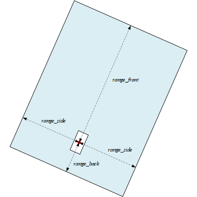
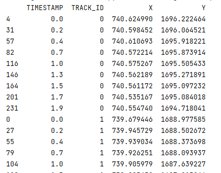
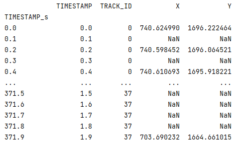
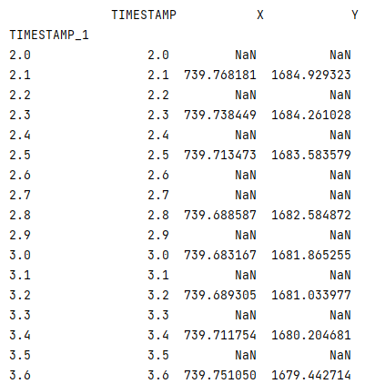
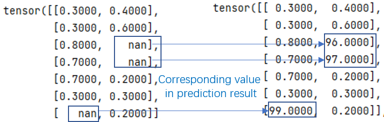

# Argoverse API - ChenChen customed

Customed code for my study use
> Original repository see [Argoverse api](https://github.com/argoai/argoverse-api)

## Changes

### 1. Maps

#### 1.1 Find surrounding centerline according to vehicle heading angle

> 20210412

Find surrounding centerline in the box whose length is in parallel with the vehicle heading.

The range can be customized as follow:



Codes can be found [Here](chenchencode/arg_customized.py)

**Use:**

``` python
from chenchencode.arg_customized import find_centerline_veh_coor

f = find_centerline_veh_coor(x0, y0, theta, city, range_dis_front, range_dis_back, range_dis_side)
surr_centerline = f.find()  # -> np.array(n,m,3)
```

**output:**

``` python
[[[x00, y00],            <- coordinates of centerline_0
  [x01, y01],
  [..., ...],
  [x0i, y0i]],
  
 [[x10, y10],            <- coordinates of centerline_1
  [x11, y11],
  [..., ...],
  [x1j, y1j]]
  
  [...      ]]
```

### 2. Data loader customized

#### 2.1 Get other vehicle data from forecasting data

*A new module in '../chenchencode/arg_customized'* ([Codes](chenchencode/arg_customized.py))

> 20210423

The original API only provides function for agent trajectory finding, but not other vehicles.

Codes can be found [Here](chenchencode/arg_customized.py)

**Use:**

``` python
from chenchencode.arg_customized import data_loader_customized

fdlc = data_loader_customized(root_dir)
fdlc[i].get_ov_traj(track_id)  # i: squence (*.csv file) int ID    -> np.array(n,2)
```

#### 2.2 Get training data from a sequence (a *.csv file)

> 20210425

A function that can extract data for a training algorithm.

**Use:**

``` python
from chenchencode.arg_customized import data_loader_customized
# Args:
#     know_num: int, traj data that are known for the prediction
#     agent_first: bool, chose agent as the prediction target, else AV
#     forGCN: if true then the outputted know_data will have standard format for each trackID
# Returns:
#     train_data: pd.DataFrame(columns = ['TIMESTAMP', 'TRACK_ID', 'X', 'Y']), n*2
#     label_data: pd.DataFrame(columns = ['TIMESTAMP', 'X', 'Y']), (50-know_num)*2 ,order is in scending time

fdlc = data_loader_customized(root_dir)
train_data, label_data = fdlc.get_all_traj_for_train(know_num=20, agent_first=True, forGCN=False)
```

**Output:**

**1) <font color=blue>train_data:</font>**

<font color=gray>(*i=0,j=1 if agent_first=True else i=1,j=0*)</font>

 If forGCN=**False**:

| index | TIMESTAMP | TRACK_ID | X    | Y    |    |  describe<br>(not in data)  |
|:----: |:----:     |:----:    |:----:|:----:|----|----|
|  1    | 0.1       |   i      |   $$x_0$$ |  y0  | <- | Agent data start|
|  2    | 0.3       |   i      |   x1 |  y1  |    <-|**<font color=red>note TIMESTAMP=0.2 is missing</font>** |
|...|...|...|...|...| | |
|  n=know_num    | 1.9       |   i      |   xn |  yn  | <- | Agent data end|
|  n+1  | 0.1       |   j      | xn1  | yn1  | <- | AV data start|
|...|...|...|...|...| |
|  m=know_num*2| 1.9       |   j      |   xm |  ym  | <- | AV data end|
| m+1   | 0.1       |   2      |   xm1|  ym1 | <- | next track start |
|...|...|....|...|...| |
|...|...|p|...|...| |other track data|
|...|...|...|...|...| |
|end|...|track_num|...|...| <- |the last track end|

Example:



* If forGCN=**True**:

| index | TIMESTAMP | TRACK_ID | X    | Y    |    |  describe<br>(not in data)  |
|:----: |:----:     |:----:    |:----:|:----:|----|----|
|  1    | 0.1       |   i      |   $$x_0$$ |  y0  | <- | Agent data start|
|  2    | 0.2       |   i      |   NaN |  NaN  |  <-|**<font color=red>note data of TIMESTAMP=0.2 is added using NaN</font>** |
|  2    | 0.3       |   i      |   x1 |  y1  |    | |
|...|...|...|...|...| | |
|  n    | 1.9       |   i      |   xn |  yn  | <- | Agent data end|
|  n+1  | 0.1       |   j      | xn1  | yn1  | <- | AV data start|
|...|...|...|...|...| |
|  m    | 1.9       |   j      |   xm |  ym  | <- | AV data end|
| m+1   | 0.1       |   2      |   xm1|  ym1 | <- | next track start |
|...|...|....|...|...| |
|...|...|p|...|...| |other track data|
|...|...|...|...|...| |
|end|...|track_num|...|...| <- |the last track end|

Example:



**2) <font color=blue>label_data:</font>**

| index | TIMESTAMP |  X    | Y    |    |  describe<br>(not in data)  |
|:----: |:----:     |:----:|:----:|----|----|
|  1    | 0.1       |    $$x_0$$ |  y0  | <- | data start|
|  2    | 0.2       |    NaN |  NaN  |  <-|<font color=red>standard format</font> |
|  2    | 0.3       |   x1 |  y1  |    | |
|...|...|...|...| | |
|  n    | 1.9       |    xn |  yn  | <- | data end, n=50-know_num|.

Example:



### 3. For Tensor training

#### 3.1 Treat on label data

> 20200430

There are some missing values due to the sample frequencies are not stable. this function fill the nan data use the
predicted data, so that can be used to calculate the loss using torch.

In '../chenchencode/arg_customized'* ([Codes](chenchencode/arg_customized.py))

**Use:**

``` python
from chenchencode.arg_customized import torch_treat
treated_label = torch_treat().label_tensor_treat(pred_data,label_data) -> label data
```
**Output:**

example:




